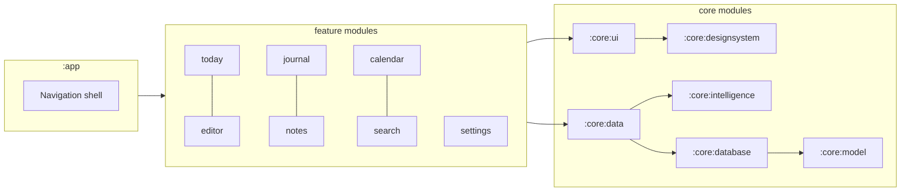

<a id="top"></a>
<div align="center">


**A private, offline-first journal for Android.**
Capture at the speed of thought, write in a real block editor, and get gentle weekly
reflections — while your words stay exactly where they belong: yours.

<br/>


<br/>

<a href="https://github.com/nibir-ai/fuso/releases/latest">
  
</a>

<br/>
<br/>

<a href="https://github.com/nibir-ai/fuso/releases">
  
</a>
&nbsp;
<a href="https://github.com/nibir-ai/fuso/issues">
  
</a>

<br/>

*Free &middot; No account required &middot; Works fully offline*

</div>

---

## Why Fuso?

Most journal apps make you choose: either a toy that's fast but shallow, or a
workspace so heavy that writing about your day feels like project management.

**Fuso refuses that trade-off.** It pairs instant natural-language capture with a
genuine block-based editor, wraps both in an offline-first sync engine, and adds a
quiet layer of reflection that reads your *patterns* — never your paragraphs.
The result is a journal you'll actually keep: one that keeps up with your life
instead of demanding you slow down for it.

## Highlights

<table>
<tr>
<td width="50%">

**Capture at the speed of thought**

Type `Lunch with dad tomorrow at 1pm` into Quick Add and Fuso parses the date,
the time, and that it's an event — highlighting what it understood as it goes.

</td>
<td width="50%">

**A real editor, not a text field**

A Notion-style block editor with a slash menu: headings, to-dos, bullet and
numbered lists, quotes, dividers — plus bold, italic, and highlight inline marks.

</td>
</tr>
<tr>
<td width="50%">

**Offline-first, always**

Room is the single source of truth. Every write lands in a local outbox and
drains to the cloud in the background when you're online. Airplane mode is a
feature, not a bug.

</td>
<td width="50%">

**Private by design**

Entries stay on your device unless you opt in to sync. AI reflections are built
from aggregate signals only — your peak hour, your streak length — never the
content of what you wrote.

</td>
</tr>
<tr>
<td width="50%">

**Momentum without guilt trips**

Streaks are counted honestly, and weekly insights read like a caring friend
noticed something — warm, human, and under fifteen words.

</td>
<td width="50%">

**Your day, in context**

A calendar view alongside your entries, awareness of your device calendar,
and daily mood check-ins on a gentle five-point scale.

</td>
</tr>
<tr>
<td width="50%">

**Find anything instantly**

Full-text search across journals and notes with match highlighting, tags,
pinning, and per-entry colors.

</td>
<td width="50%">

**Four themes, including true black**

System, Light, Dark, and Pitch Black — a proper OLED theme built from the same
warm paper-and-ink palette that runs through the whole app.

</td>
</tr>
</table>

## Screenshots

<!-- Drop screenshots into docs/screenshots/ using these filenames, then uncomment:

<p align="center">
  
  &nbsp;
  &nbsp;
  &nbsp;
  &nbsp;
</p>

-->

## How sync works

```
You write ──▶ Room (local DB) ──▶ Outbox queue ──▶ WorkManager
                                        │               │ offline: waits patiently
                                        ▼               ▼ online: batched push + pull
                                     Supabase (Postgres) ◀── merge back to device
```

Writes never block on the network. The [sync engine](core/data/src/main/kotlin/com/fuso/core/data/sync/SyncEngine.kt)
pushes queued operations in batches, pulls remote changes, and reports status —
`Idle · Running · Succeeded · Failed · SignedOut` — so the UI always knows where things stand.

## Under the hood



| Layer | Technology |
|---|---|
| Language | Kotlin 2.4, coroutines & Flow |
| UI | Jetpack Compose, Material 3, custom design system |
| Dependency injection | Hilt |
| Persistence | Room 2.8 (schema exports + migrations) |
| Background work | WorkManager |
| Cloud sync | Supabase (Postgres) via OkHttp + kotlinx.serialization |
| Intelligence | Gemini API — aggregate signals only |

Every feature is a module, every module has a reason to exist, and nothing in
`feature/*` knows how storage or networking actually works. That's the point.

## Build it yourself

**Requirements:** Android Studio (AGP 9 compatible) · JDK 17+ · Android SDK 37

```bash
git clone https://github.com/nibir-ai/fuso.git
cd fuso
./gradlew :app:assembleDebug
# APK → app/build/outputs/apk/debug/app-debug.apk
```

Run the unit tests:

```bash
./gradlew test
```

Cloud sync and AI insights are **optional**: the app runs completely offline out
of the box. To enable them, plug in your own Supabase project and Gemini API key
from the in-app settings.

## Roadmap

- [ ] Export & backup (Markdown / JSON)
- [ ] Home-screen widget for one-tap capture
- [ ] End-to-end encrypted sync
- [ ] On-this-day memories
- [ ] Yearly wrap-ups

Have an idea? [Open a discussion](https://github.com/nibir-ai/fuso/issues) —
the best roadmap items come from people who actually journal.

## Contributing

Issues and pull requests are welcome. For anything larger than a typo, open an
issue first so we can align on direction before you spend time on code.

1. Fork & create your branch from `main`
2. Make your change, add tests if it's logic
3. `./gradlew test` and `./gradlew :app:assembleDebug` must pass
4. Open a PR with a clear description

## License

Copyright &copy; 2026 nibir-ai. All rights reserved.

An open-source license is being evaluated — until one is published, all rights
are reserved and the code may be read and learned from, but not redistributed.

---

<div align="center">

**Fuso** — write today. Remember forever.

<a href="#top">Back to top &#8593;</a>

</div>
