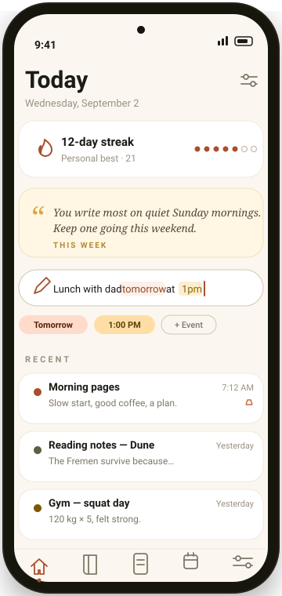
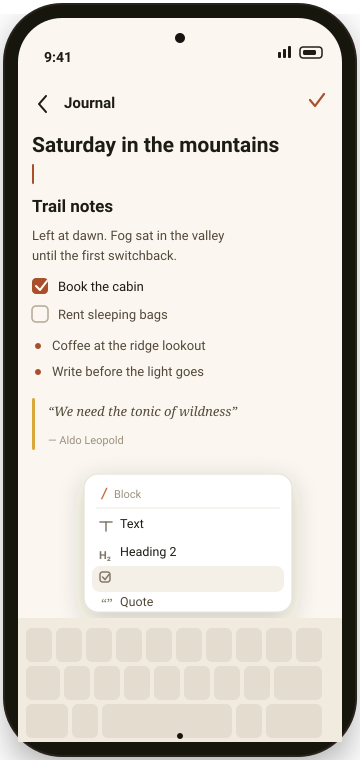
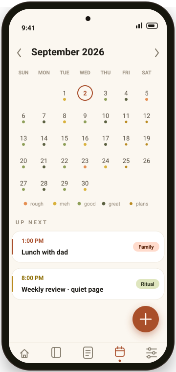
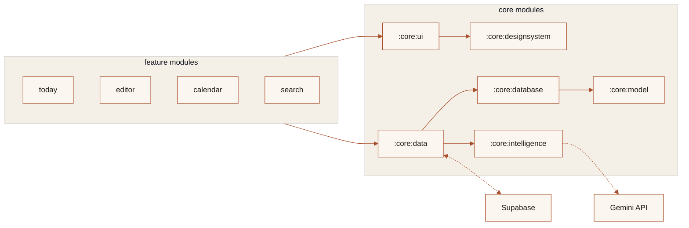

<a id="top"></a>
<div align="center">


<br/>

### Most journals ask you to slow down. Fuso keeps up.

**Fuso is a private, offline-first journal for Android** — capture a thought in
one line, expand it in a real block editor, watch gentle weekly reflections
appear. Your words never leave your device unless you say so.

</div>

<div align="center">


<br/>

<a href="https://github.com/nibir-ai/fuso/releases/latest">
  
</a>

<br/>
<br/>

<a href="https://github.com/nibir-ai/fuso/releases">
  
</a>
&nbsp;&nbsp;
<a href="https://github.com/nibir-ai/fuso/issues">
  
</a>

*free &middot; no account required &middot; works fully offline*

</div>

---

<div align="center">

</div>

## Three screens. One calm place.

<table>
<tr>
<td align="center" width="33%">
<br/>
<sub><b>Today</b> &nbsp;&#183;&nbsp; streaks, a weekly reflection,<br/>and one-line capture that just gets you</sub>
</td>
<td align="center" width="33%">
<br/>
<sub><b>Editor</b> &nbsp;&#183;&nbsp; headings, to-dos, quotes —<br/>a slash menu away, like thinking out loud</sub>
</td>
<td align="center" width="33%">
<br/>
<sub><b>Calendar</b> &nbsp;&#183;&nbsp; mood at a glance, events<br/>from your device calendar, zero effort</sub>
</td>
</tr>
</table>

Every pixel above is drawn from Fuso's real palette — warm paper, ink, terracotta.
No stock screenshots. This *is* the app.

---

<div align="center">

</div>

## Type a sentence. Fuso hears the when.

<div align="center">

</div>

Quick Add runs a small natural-language parser **on-device**: dates, weekday
names, clock times, and twenty everyday event words. What it understands gets
highlighted as you type, then folded into chips. What it doesn't understand,
it leaves alone — because a journal should never put words in your mouth.

---

<div align="center">

</div>

## Built different

<table>
<tr>
<td width="50%">

&nbsp;&nbsp;**Capture at the speed of thought**

The whole write path is local Room inserts behind a coroutine. No spinners,
no sync anxiety — the entry exists before your thumb leaves the key.

&nbsp;

</td>
<td width="50%">

&nbsp;&nbsp;**A block editor, not a textarea**

Eight block types — paragraphs, three heading levels, to-dos, bullets,
numbered lists, quotes, dividers — serialized as typed JSON so your
structure survives every sync.

&nbsp;

</td>
</tr>
<tr>
<td width="50%">

&nbsp;&nbsp;**Offline-first by architecture**

Writes land in an outbox queue and drain to Supabase in batches through
WorkManager. Airplane mode isn't an error state; it's Tuesday.

&nbsp;

</td>
<td width="50%">

&nbsp;&nbsp;**AI that reads patterns, not pages**

Weekly reflections are generated from aggregate counters — peak hour,
streak length, word volume. Your sentences are never sent anywhere.

&nbsp;

</td>
</tr>
<tr>
<td width="50%">

&nbsp;&nbsp;**Momentum without guilt**

Honest streaks computed from your actual journal days, and nudges written
to sound like a friend noticed something — never a notification badge.

&nbsp;

</td>
<td width="50%">

&nbsp;&nbsp;**Four themes, including true black**

System, Light, Dark, and Pitch Black — a real OLED theme cut from the same
warm paper-and-ink palette, not just inverted colors.

&nbsp;

</td>
</tr>
<tr>
<td width="50%">

&nbsp;&nbsp;**Your life, in context**

A calendar view beside your entries, daily five-point mood check-ins, and
read-only awareness of your device calendar.

&nbsp;

</td>
<td width="50%">

&nbsp;&nbsp;**Find the thought again**

Full-text search across journals and notes with live match highlighting,
plus tags, pinning, and per-entry colors for the visual memory.

&nbsp;

</td>
</tr>
</table>

---

<div align="center">

</div>

## Under the hood



**Kotlin 2.4 · Compose + Material 3 · Hilt · Room 2.8 with exported schemas &
migrations · WorkManager · OkHttp + kotlinx.serialization.**
Every feature is a module; nothing in `feature/*` knows how storage or the
network actually work. That's the point.

> **Privacy, in one line:** entries live in a local Room database; cloud sync is
> opt-in with your own Supabase project; AI insights receive six anonymous
> numbers — never text. Delete the app, and everything stays deleted.

---

<div align="center">

### Get Fuso on your phone

<a href="https://github.com/nibir-ai/fuso/releases/latest">
  
</a>

</div>

<details>
<summary><b>Build it yourself</b></summary>

<br/>

Requirements: Android Studio (AGP 9 compatible), JDK 17+, SDK 37.

```bash
git clone https://github.com/nibir-ai/fuso.git
cd fuso
./gradlew :app:assembleDebug   # APK → app/build/outputs/apk/debug/
./gradlew test                 # unit tests
```

Cloud sync and AI insights are optional — enable them in-app with your own
Supabase project and Gemini API key.

</details>

<details open>
<summary><b>Roadmap</b></summary>

<br/>

- [ ] Export &amp; backup — Markdown / JSON
- [ ] Home-screen widget for one-tap capture
- [ ] End-to-end encrypted sync
- [ ] On-this-day memories
- [ ] Yearly wrap-ups

Ideas welcome in [Issues](https://github.com/nibir-ai/fuso/issues) — the best
roadmap items come from people who actually journal.

</details>

---

## Contributing

PRs welcome. For anything beyond a typo, open an issue first so direction gets
aligned before code gets written. `./gradlew test` must pass.

## License

Copyright &copy; 2026 nibir-ai. All rights reserved. An open-source license is
being evaluated; until one is published, read and learn from the code freely,
but don't redistribute it.

---

<div align="center">


<i>fuso</i> <b>&middot;</b> write today. remember forever.

<a href="#top">back to top &#8593;</a>

</div>
